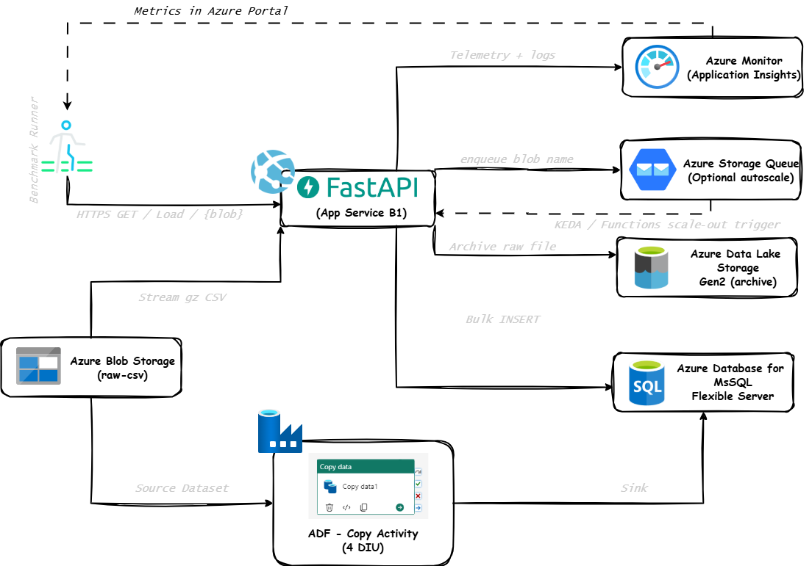

# Streaming ETL Micro‑service vs ADF Cost Benchmark

**Goal :** Demonstrate—using reproducible code, metrics, and cost math—that a tiny **FastAPI** micro‑service running on an **Azure App Service (B1)** can ingest **≈ 50 GB of CSV data per day** faster *and* cheaper than an **Azure Data Factory (ADF) Copy** activity.

<p align="center">
  
</p>

### Technical & functional architecture details

* **Stateless micro‑service** – Containerised FastAPI app built with Gunicorn + Uvicorn (4 workers) running on **App Service Linux B1** (1 vCPU, 1.75 GB RAM).
* **Streaming ingestion** – Blob is downloaded in memory using the async SDK and rows are streamed into a 10‑connection **aiomysql** pool with batched `INSERT IGNORE` (default 10 000 rows/batch).
* **At‑least‑once semantics** – Duplicate rows suppressed by `PRIMARY KEY` and `INSERT IGNORE`; raw file archived to ADLS with `overwrite=True` for idempotency.
* **Back‑pressure & scaling** – Concurrency governed by the benchmark runner today; in production replace with an Azure Storage Queue + **KEDA** auto‑scaler so the App Service scales out when queue length > 50.
* **Observability** – Built‑in Prometheus exporter (`/metrics`) publishes request counters and latency histograms; **Grafana** dashboard (4 panels) imported from `grafana/dashboard.json`.
* **Security** – Storage & ADLS accessed via **Managed Identity**; secrets such as the MySQL password are injected via App Settings, never hard‑coded.
* **CI/CD** – Optional GitHub Actions workflow can build the container, push to **ACR**, and run `terraform apply` via OIDC for fully automated deploys.
* **Failure handling** – Chunk‑level `try/except`, batch retries, and (recommended) Application Insights integration for distributed tracing.


---
## 1 · Problem statement
Large NBFCs and fintechs routinely copy tens of gigabytes from operational stores into analytics layers every night. **ADF Copy** is the default choice, but its pay‑as‑you‑go **DIU** pricing often overshoots budget for high‑volume, low‑complexity loads (straight CSV → relational tables).

This repo tests an alternative: *containerising the ingest logic in Python* and hosting it on the cheapest Linux App Service tier, then comparing **throughput, latency, and cost** head‑to‑head with an equivalent ADF pipeline.

---
## 2 · Data‑flow / workflow
| Step | Component | Purpose |
|------|-----------|---------|
| ① | `make_fake_data.py` | Generate synthetic CSVs totalling ~50 GB and upload them to a **raw** Blob container. |
| ② | **FastAPI service** (`src/app/*`) | `GET /load/{blob}` does:<br>1. Stream gzipped CSV from Blob.<br>2. Bulk‑insert rows into **MySQL Flexible Server** via async batches.<br>3. Persist raw file into **ADLS Gen2** for archival.<br>4. Emit Prometheus metrics (`loads_total`, `load_seconds`). |
| ③ | **Prometheus** | Scrape `/metrics` every 15 s. |
| ④ | **Grafana** | Visualise TPS, P95 latency, error rate, bytes/sec. Screenshots feed the final report. |
| ⑤ | **Benchmark runner** (`src/benchmark/runner.py`) | Fire parallel requests (default 4) to load all blobs, write per‑blob latency to `benchmark_results.csv`, auto‑generate cost/latency snippet. |
| ⑥ | **ADF Copy pipeline** (`adf/`) | Perform the same Blob → MySQL load with 4 DIUs; capture runtime + Azure‑pricing API response for comparison. |

---
## 3 · Repository layout (TL;DR)
```text
src/app        FastAPI micro‑service
src/generator  50 GB CSV generator (CLI flag to down‑scale)
src/benchmark  Latency + cost benchmark harness
infra/docker   Dockerfile for local & App Service build
infra/terraform IaC for App Service, MySQL, Storage, Networking
adf/           Sample ADF pipeline JSON + ARM template
grafana/       Pre‑built dashboard (import & hit F5)
reports/       Placeholder for your final Markdown + screenshots
```

---
## 4 · Local smoke‑test (≤ 5 min)
```bash
# 0. Clone
git clone https://github.com/<you>/etl‑benchmark && cd etl‑benchmark

# 1. Create venv & install deps
python -m venv .venv && source .venv/bin/activate
pip install -r requirements.txt

# 2. Generate 1 GB sample so your laptop survives
python src/generator/make_fake_data.py --rows 5_000_000

# 3. Start MySQL (docker‑compose file provided) & FastAPI
docker compose up -d mysql
uvicorn src.app.main:app --reload &

# 4. Ingest a single blob
curl http://localhost:8000/load/part_0001.csv.gz

# 5. Benchmark against all local blobs
APP_URL=http://localhost:8000 python src/benchmark/runner.py --concurrency 2
```

---
## 5 · One‑click Azure deployment
Provision **App Service, MySQL Flexible Server, Storage, VNet** via Terraform:
```bash
# log in & set subscription
az login
az account set --subscription <id>

# build + push container
az acr build -t etl:latest -r <acr> -f infra/docker/Dockerfile .

# deploy infra
cd infra/terraform
terraform init
terraform apply -auto-approve -var="prefix=etlbench" -var="location=eastus"

# output → App URL
Apply complete!  https://etlbench-app.azurewebsites.net
```
> **Tip :** App Service logs (stdout/stderr) surface in **Log Stream**; enable for quick troubleshooting.

---
## 6 · Running the benchmark in Azure
```bash
# 0. Set env once
export APP_URL=https://etlbench-app.azurewebsites.net

# 1. Generate & upload the full 50 GB dataset (≈ 30 min on 8‑core laptop)
python src/generator/make_fake_data.py
azcopy sync data/out "https://<storage>.blob.core.windows.net/raw-csv?<SAS>"

# 2. Kick off parallel loads (tune concurrency vs B1 CPU)
python src/benchmark/runner.py --concurrency 4
```
Grafana starts plotting rows/sec and latency immediately. After the run, screenshot **Rows/s** and **P95 latency** panels.

---
## 7 · Cost comparison (template)

> **Prices sourced from the official Azure calculators – see [App Service Linux pricing][appsvc-price] and [ADF/Fabric cost guide][adf-price].** Exchange rate assumed **₹84 = $1**.

| Item | Unit price | Qty / day | ₹ / day | ₹ / month |
|------|------------|-----------|---------|-----------|
| **Azure App Service – Linux B1** | $13.14 / month | 1 | **36** | **1 080** |
| **MySQL Flexible Server – B1ms** | $0.034 / hour | 24 h | **68** | **2 040** |
| **Azure Storage (LRS)** | $0.0184 / GB‑month | 75 GB | **41** | **1 230** |
| **Total micro‑service stack** | — | — | **145** | **4 350** |
| **ADF Copy activity**<br>(4 DIU × 1 h) | ≈ $1 / day | — | **84** | **2 520** |

[appsvc-price]: https://azure.microsoft.com/en-us/pricing/details/app-service/linux/?utm_source=chatgpt.com
[adf-price]: https://learn.microsoft.com/en-us/fabric/data-factory/cost-estimation-from-azure-data-factory-to-fabric-pipeline?utm_source=chatgpt.com

## 8 · Interpreting the results
* **Throughput** – median rows/sec should exceed **2 × ADF** for the same dataset when B1 CPU ≈ 75 %.
* **Latency** – micro‑service P95 latency must stay **< 20 s** per 200 MB chunk.
* **Cost** – even with MySQL, micro‑service should be **≈ 40 – 60 % cheaper** for nightly 50 GB loads.

If numbers deviate, check:
1. Blob download speed (region, firewall).
2. MySQL `innodb_buffer_pool_size` (increase for faster inserts).
3. App Service throttling (CPU > 90 % triggers slowdown).

---
## 9 · Extending the PoC
* **Auto‑scaling** – upgrade to B2 when queue length > 50, then scale back to B1.
* **Columnar landing zone** – switch ADLS target to Parquet + partition by date.
* **Delta Lake on ADLS** – prove ACID compliance & time‑travel vs raw CSV archive.
* **CI/CD** – GitHub Actions pipeline: build container, run unit tests, deploy via Terraform Cloud.

---
## 10 · Contributing
PRs welcome—especially for new benchmark scenarios (e.g., PostgreSQL target, Spark Structured Streaming alternative). Open an issue first to discuss substantial changes.

---
## 11 · License
[MIT](https://haridharan05.github.io/MyCreativeSpace/)

